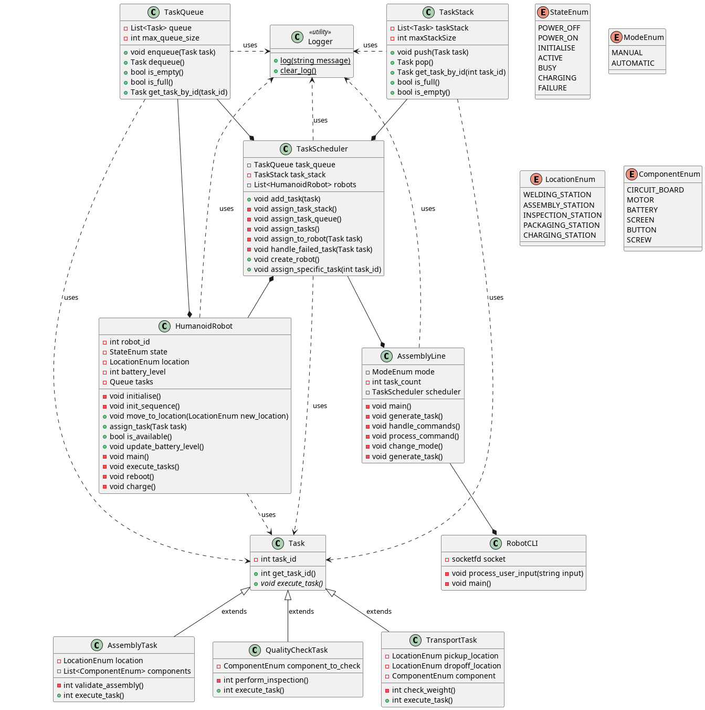
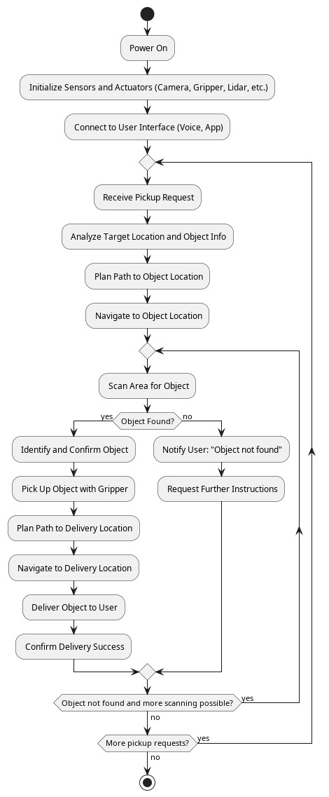

# UML

The Humanoid Robot assignments are what I feel I have learned the most from in the module. I felt that first designing the system with the help of UML diagrams to be used, along with feedback received from the tutor, to implement the proposed design was both a sensible and logical workflow. The use of UML diagrams really helped me flesh out what the intended system would need to do. I especially found creating the class diagram, shown below, helpful.

My background as a software engineer is primarily in relation to safety critical software, so using UML as a tool is not unfamiliar to me. In order to refresh my understanding I read through the Unit 4 conference paper by Huzar, Z. et al. (2005) 'Consistency Problems in UML-Based Software Development'. I found that one section in particular stood out to me, in relation to approaches for checking the consistency of the model. They state that the use of formal languages such as B, a "state-based method ... for specifying, designing and coding software systems" (https://www.cai.sk/ojs/index.php/cai/article/view/456), can be used to perform these checks. Being unfamiliar with the B method I then researched it further and found it shares similarities with Z notation, a branch of formal methods for  specifying computer-based systems. It allows for the behaviour of the system to be reasoned about in a mathmatical way and has found uses in both academic and industrial settingsm (https://link-springer-com.uniessexlib.idm.oclc.org/chapter/10.1007/978-3-319-29628-9_3).

In a previous role, I gained experience with the Z formal specification language, which was employed in the development of a UK air traffic control system. Encountering the use of formal methods in the context of UML was therefore unexpected. However, upon reflection, the integration of formal specification techniques with design models appears both logical and advantageous. Having previously worked with tools such as SPARK, a formally defined subset of the Ada programming language used for the development and verification of high-integrity systems (https://link-springer-com.uniessexlib.idm.oclc.org/chapter/10.1007/978-3-319-66266-4_7), I have developed an appreciation for the role of formal methods in enabling rigorous reasoning about software. What I had not fully considered before, however, was the potential of applying formal reasoning techniques at the design stage. Reflecting on this has led me to recognise the significant benefits such an approach could bring.

The Correctness-by-Construction (CbC) approach has been a fundamental principle throughout my career in the development of safety-critical software. CbC promotes an incremental method of software development, whereby the process is initially guided by a formal specification and subsequently refined through the application of rules that impose side conditions to ensure the program's correctness at each stage (https://dl-acm-org.uniessexlib.idm.oclc.org/doi/pdf/10.1145/3591335.3591343). While the benefits of this approach are clear, in practice I have often found its application to be overly prescriptive, leaving little scope for the integration of UML models during the design phase. Upon reflection, I now recognise that combining the rigor of CbC with tools designed to ensure the consistency of UML models could significantly enhance the development of safety-critical systems. This insight has prompted me to explore this integration further in my professional work.

I thought it quite remarkable that a single paragraph in the reading for Unit 4 lead to this wider realisation and intent to apply the findings to my professional work.

## PlantUML

As part of Unit 4 I also started thinking about what function my Humanoid Robot would serve. It was at this point that I decided to pursue the idea of a robot working within an assembly line type of environment. In order to try and begin fleshing out the workflow of the robot, I created an activity diagram, shown below.

For all UML diagrams in the module I used PlantUML. This is a tool I have used previously in a professional capacity. It uses its own versatile language, offering a programmatic approach to the generation of diagrams. This allows for diagrams to remain dynamic in nature as all generation of diagram elements is handled by PlantUML itself. I found this extremely useful as it meant I could quickly iterate over each diagram without having to spend time manually redrawing connections or moving elements around. I did however find that sometimes I had to play around with the ordering of certain elements in order to make the layout of the diagram appear a certain way. This was certainly not a major issue with the tool and for future assignments I plan to continue using it as it definitely helped reduce time spent on diagrams, leaving crucial time to focus on other important aspects of the assignments.

