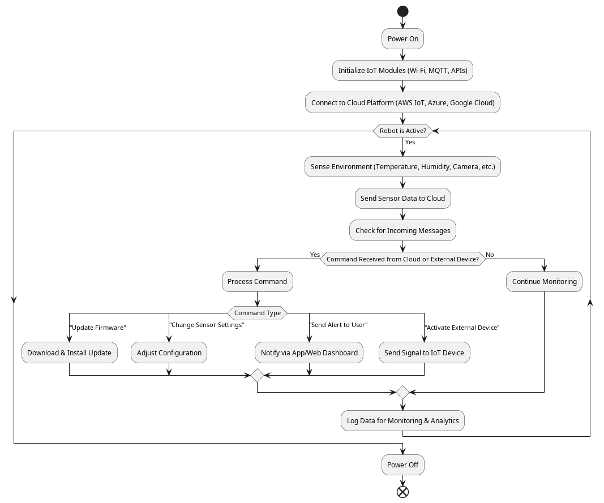

# Individual Coding Assignment

## Experience
I found that I learned the most from the individual coding assignment. I felt that the problem environment was interesting and applied many of the learned concepts in a way that made the problem of security feel more real. Below are some reflections looking back on how the solution evolved following the group project.

### System Design
The design proposed in the group assignment was a lot more complex than that of the final implementation. This was mostly however due to the fact that the Flask-RESTful library superseeded many of the classes defined in the class diagram. For example, the SessionManager functionality is something that is offered out of the box by way of providing the developer with a way to get the token of the user that is logged in. This made session authentication as simple as decoding the session token and checking the correct priviledges were held to perform the requested operation. Having security features managed by a well-known library is preferable since as an individual I am much more likely to make mistakes implementing these features. It does however mean that should a security vulnerability be found in this library, my application becomes at risk.

### Development Approach and Issues
I found that I spent too much time debugging issues relating to small logic errors that resulted in database or run-time exceptions. Looking back, this can be partly attributed to my approach regarding endpoints. I still believe that the approach to have one set of secure and insecure endpoints, with logic to route to the relevant one depending on whether or not the application was in secure mode, was a sensible one. However this did ultimately result in large amounts of duplicated code that meant I would fix many similar bugs in multiple areas. If I were to repeat the assignment I would spend time consolidating this duplicate code into helper functions that each endpoint could make use of. My original thinking was that I would get around to this once I had implemented the base set of features however it would have saved me more time in the long run I expect were I to address this sooner.

In order to make the system susceptible to SQL injection attacks, SQL parameterisation was not used, instead being replaced with the `executescript` function which can be used to chain multiple commands together.


My original intention was to have all insecure endpoints susceptible in this way however I discovered that using this function meant no results were returned when querying a database therefore preventing proper functionality. This was another sink of time, as I spent considerable effort trying for both functionality alongside susceptibility. Ultimately I decided that it was better to leave a single endpoint exposed and make a hard check for the contents of the request, in the interest of time.

### Testing
Due to the aforementioned lack of time towards the end of the assignment, testing was neglected more than I would have liked. I used PyTest to write some unit tests that verified permissions based functionality however I recognise the scope of this was limited. For example there were no tests verifying that records had been properly deleted following a request to do so. Should the testing approach been allotted more time, I believe it would have become more difficult to test due to some of the code. For example the `process_command` function which handles user input within the command line interface (CLI) programme, seen below.


As can be seen, the IDE is warning of high cyclomatic complexity which is a measure of the number of linearly independent paths that a piece of software can take (McCabe, 1976). It is just one way to apply metrics to software in order to measure its complexity. This was touched on in unit 5, with my thoughts on the question given presented below.

**_The Cyclomatic Complexity is commonly considered in modules on testing the validity of code design today. However, in your opinion, should it be? Does it remain relevant today?:_**  Being able to apply metrics to your code in order to generate an objective figure for properties such as complexity can no doubt be useful. However for me, the question remains of how much use this is to the developer. Personally I believe that it should still be considered but not in isolation. That is to say that it offers just one viewpoint as to the quality of a piece of code. It can be useful in identifying overly complex code that has many branches and therefore possible routes it can take. The result is that you end up with code that is harder to maintain and test, especially should unit tests be written that aim to cover each path. However, with today's modern practices making use of automated testing tools the effort to exhaust these paths is not quite as large as it once was.


As mentioned in my UML page, I feel that these assignments are what I got the most out of in the module. I thought that the problem environment was an interesting one and lent itself well to an object orientated approach. Below are some of my reflections looking back on the system design and implementation assignments.

## System Design
I found that the formative activities in the weeks leading up to the design assignment really helped in understanding the context of the task. I found the reading of chapter 18 in 'Think Python' in Unit 5 especially useful as it helped remind me of some of Python's quirks, such as list comprehension. The section that turned out to be most useful was that on 'unittest', a python package designed to make writing unit tests simpler. A unit test independently verifies the smallest logical component of a program. In procedural or functional programming languages, this is typically a subroutine or function (Lenz, 2018).

Through previous professional experience, I have used unit tests, but not with Python. Therefore I was interested to read about this package and how it can aid the developer in testing their software. I immediately knew that I would want to make use of this tool when the implementation stage came. I thought that the ability to define separate tests, have them all automatically run and to be presented with a clear output of any failing tests was impressive. I made a note of this and returned to it during the implementation stage.

I took the opportunity to complete the Unit 5 polymorphism exercise and created a simple implementation of Humanoid Robot classes, shown below.

```python
# Base class
class HumanoidRobot:
    def __init__(self, name, model):
        self.name = name
        self.model = model

    def info(self):
        raise NotImplementedError("Subclasses must implement the info method")

    def perform_task(self):
        raise NotImplementedError("Subclasses must implement the perform_task method")

# Subclass 1
class AssemblerRobot(HumanoidRobot):
    def info(self):
        print(f"I am an Assembler Robot. My name is {self.name}, model {self.model}.")

    def perform_task(self):
        print("I help assemble components.")

# Subclass 2
class TransportRobot(HumanoidRobot):
    def info(self):
        print(f"I am a Transport Robot. My name is {self.name}, model {self.model}.")

    def perform_task(self):
        print("I help transport components.")

# Subclass 3
class QualityAssuranceRobot(HumanoidRobot):
    def info(self):
        print(f"I am a Quality Assurance Robot. My name is {self.name}, model {self.model}.")

    def perform_task(self):
        print("I ensure assembled components are of the required standard.")

# Create instances
robot1 = AssemblerRobot("Assembler", "A100")
robot2 = TransportRobot("Transporter", "T300")
robot3 = QualityAssuranceRobot("QualityAssurance", "QA200")

# Use polymorphism
for robot in (robot1, robot2, robot3):
    robot.perform_task()
    robot.info()
    robot.perform_task()
```

My final implementation featured a very similar approach to the handling of tasks, with a parent task class featuring an abstract "execute task" method which was then extended from in subclasses. Completing this exercise proved useful and helped guide the final approach so I feel that it was worthwhile.

On reflection, I found that the reading leading up to the assignment did not present me with much difficulty, as many of the concepts are ones I have been using now for many years in my job. It did however give me time for pause and a chance to think deeper about how best to apply what I already know. I am fortunate enough to approach these tasks with many previous experiences that have helped shape my approach to future similar tasks. For example the separation of logic between the robot, backend and user interface came intuitively to me. Whereas I feel that with less experience this would have been an area of confusion for me.

Overall I feel that the design stage of the assignment went well. The proposed system did not deviate significantly from the end product, which reflects the thorough planning and consideration that went into the design stage. I feel that an area of improvement for me in my job is to sometimes slow down and try and consider the bigger picture. I have always found this a difficult task as it inherently relies on the ability to foresee potential future problems. This design activity has proven to me that taking time before starting to write code can help achieve this, by uncovering potential issues rather than encountering them later in development.

## System Implementation
This assignment provided a great opportunity for me to deepen my experience with Python, a language I had previously only used for simple scripting, particularly in applying object oriented programming principles. As part of the collaborative discussion for Units 8, 9 & 10 I created an example activity diagram for a Humanoid Robot, for which I have more detailed reflections in a separate post. While this was for a robot within an Internet of Things (IoT) environment, it did help consolidate some of the ideas that I was unsure of in my own implementation such as the sequence of operations, data flows and interactions between sub-systems. 



Going into the development for the humanoid robot, I was expecting that it wouldn't take me long to get a working prototype up and running given I had spent time planning the architecture beforehand in the design assignment. However I found that I soon hit blockers. For example when implementing the backend assembly line logic, I discovered that if I were to host the robot logic within the same thread, the regular generation of tasks would be disrupted should the robot take time to move to a new location or execute a task. This therefore necessitated the early decision to split the software across multiple threads. I have been using threads extensively in my current work therefore I didn't have to spend time learning about them, which was a benefit as it helped keep development times down. I was left feeling impressed with how simple the python threading package was to use. It abstracted all difficulty in setting up and managing threads away from the developer and allowed me to get multiple running very quickly. Approaching it with previous experience using threads certainly helped but I have no doubt should I have been new to them I would have been able to create the same result without much added effort. This is one of the main benefits that I have often seen with python, it "just works". In terms of going from nothing to a quick prototype I feel that no other language comes close. This was especially useful in this project where multiple deviations from the originally intended were needed.

Another change between the design and implementation was regarding the AUTOMATIC and MANUAL operating modes. I had originally intended for each robot to have its own mode however quickly found that it made more sense for the assembly line as a whole to operate either automatically or through user input. I felt that it made more sense for coordination of the system and managing of tasks to be centralised along with allowing for the complexity within the robot operation to be reduced. This change didn't require any major rework to my original design, merely for some logic to be moved from within each robot to within the assembly line back end. I think that this indicates a well thought out design on my part and that there was low coupling between modules.

The below video demonstrates the software in use. The creation of multiple robots is shown, a transition to MANUAL mode and the assignment of a task to the next available robot.

<iframe width="860" height="460" src="https://youtube.com/embed/xrob7s5PbCA" title="YouTube video player"></iframe>

On reflection, I felt as if the two assignments really allowed me to explore the main principles of OOP while implementing extra functionality to go beyond the scope of the brief. I enjoyed going first through the process of defining the architecture for the programme, to the implementation then based upon this. I feel as if I was able to consolidate many skills in relation to OOP and software architecture alongside gaining an understanding of the applications that UML has within OOP.

### References
McCabe, T. J. (1976) 'A Complexity Measure', **IEEE Transactions On Software Engineering**, SE-2(4), pp. 309. Available at: https://ieeexplore-ieee-org.uniessexlib.idm.oclc.org/stamp/stamp.jsp?tp=&arnumber=1702388&tag=1 (Accessed: 17 July 2025)