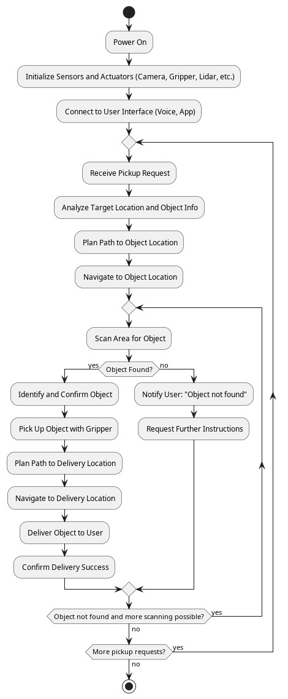

# Group Project

## Experience
This was my first experience of completing an assignment within a group environment. Having not completed a degree prior to enrolling on this course I was unsure what to expect. From speaking with friends and coworkers, their own experiences were varied. Some reported enjoyable experiences where they felt that they were put with a group of people who all bounced off of eachother and therefore produced a high pedigree of work. Whereas others reported teammates who struggled to pull their weight and contributed little to the project. Going into it I therefore was hopeful that I would be grouped with people that fell into the former category described by those I know.

My experience was that even getting the group together on one platform to communicate was difficult. Another individual in the group sent an email to everyone suggesting we use Discord, with a link to a server they helpfully set up. This was perfect and I felt optimistic about having someone who took the initiative to do this. However I then found that I was the only one to join for some considerable time, with the two of us having to reach out to the tutor in order to have emails sent to their personal emails instead of university ones. This seemed to make others take notice and we finally had a group together in the Discord.

By this point however, the two of us had drafted the team contract as we had already exceeded the deadline having waited for others to join. Overall though I was happy with the contract we drafted, I drew on my experience as a software engineer to define roles that each of us could take turns doing. I decided to use roles commonly used in an agile workflow, as these are what I am most familiar with, such as Product Owner and Scrum Master. I felt that using roles with well defined responsibilities would help those less familiar in knowing what their role would be that week (the intention was to rotate roles weekly.)

Once we had the entire team in the Discord I was then proactive about trying to organise a call where we could brainstorm together. I felt that this was important. It would have been possible to do this over instant messaging but due to being in different time zones I really felt the asynchronous nature would complicate things. I found that organising this call was incredibly difficult though. It seemed to be only myself and the other more proactive team member who made any attempt at getting the team together, we both utilised a combination of messaging and polls to make it as easy for others to respond as possible however neither had much success. We eventually did manage to agree a time and date but only after a number of messages stressing the urgency of the situation.

Our one team meeting was reasonably successful. The three of us who were present were all attentive to one anothers thoughts and suggestions. The end result was a directed approach we all agreed on with packages of work being distributed to each team member. I was assigned to look into how each of the security vulnerabilities would be implemented in the design. This lead to me attempting to perform a Denial of Service (DoS) attack on my own computer as a proof of concept. This form of attack involves making a computer system, service or network unavailable to intended users by flooding it with illegitimate requests. As a result users may experience slow performance while the large volume of requests are processed (Mirkovic et al., 2004). One method I attempted was using SYN floods, an excerpt of which can be seen below.

The intended result was to slow a simple server script running in parallel due to the demand to field so many requests. However this didn't ultimately work, I believe due to pre-configured firewall rules on my machine.

## Reflections
- not wanting to write all the contract, important to balance others opinions
- taking the lead with trying to organise meetings
- why difficult to organise the call
- researching vulnerabilities

The Humanoid Robot assignments are what I feel I have learned the most from in the module. I felt that first designing the system with the help of UML diagrams to be used, along with feedback received from the tutor, to implement the proposed design was both a sensible and logical workflow. The use of UML diagrams really helped me flesh out what the intended system would need to do. I especially found creating the class diagram, shown below, helpful.

My background as a software engineer is primarily in relation to safety critical software, so using UML as a tool is not unfamiliar to me. In order to refresh my understanding I read through the Unit 4 conference paper by Huzar, Z. et al. (2005) 'Consistency Problems in UML-Based Software Development'. I found that one section in particular stood out to me, in relation to approaches for checking the consistency of the model. They state that the use of formal languages such as B, a "state-based method ... for specifying, designing and coding software systems" (Cansell and Mery, 2003, p. 1), can be used to perform these checks. Being unfamiliar with the B method I then researched it further and found it shares similarities with Z notation, a branch of formal methods for  specifying computer-based systems. It allows for the behaviour of the system to be reasoned about in a mathmatical way and has found uses in both academic and industrial settings (Bowen, 2014).

In a previous role, I gained experience with the Z formal specification language, which was employed in the development of a UK air traffic control system. Encountering the use of formal methods in the context of UML was therefore unexpected. However, upon reflection, the integration of formal specification techniques with design models appears both logical and advantageous. Having previously worked with tools such as SPARK, a formally defined subset of the Ada programming language used for the development and verification of high-integrity systems (AdaCore, no date), I have developed an appreciation for the role of formal methods in enabling rigorous reasoning about software. What I had not fully considered before, however, was the potential of applying formal reasoning techniques at the design stage. Reflecting on this has led me to recognise the significant benefits such an approach could bring.

The Correctness-by-Construction (CbC) approach has been a fundamental principle throughout my career in the development of safety-critical software. CbC promotes an incremental method of software development, whereby the process is initially guided by a formal specification and subsequently refined through the application of rules that impose side conditions to ensure the program's correctness at each stage (Bordis et al., 2023). While the benefits of this approach are clear, in practice I have often found its application to be overly prescriptive, leaving little scope for the integration of UML models during the design phase. Upon reflection, I now recognise that combining the rigor of CbC with tools designed to ensure the consistency of UML models could significantly enhance the development of safety-critical systems. This insight has prompted me to explore this integration further in my professional work.

I thought it quite remarkable that a single paragraph in the reading for Unit 4 lead to this wider realisation and intent to apply the findings to my professional work.

## PlantUML

As part of Unit 4 I also started thinking about what function my Humanoid Robot would serve. It was at this point that I decided to pursue the idea of a robot working within an assembly line type of environment. In order to try and begin fleshing out the workflow of the robot, I created an activity diagram, shown below.

For all UML diagrams in the module I used PlantUML. This is a tool I have used previously in a professional capacity. It uses its own versatile language, offering a programmatic approach to the generation of diagrams. This allows for diagrams to remain dynamic in nature as all generation of diagram elements is handled by PlantUML itself. I found this extremely useful as it meant I could quickly iterate over each diagram without having to spend time manually redrawing connections or moving elements around. I did however find that sometimes I had to play around with the ordering of certain elements in order to make the layout of the diagram appear a certain way. This was certainly not a major issue with the tool and for future assignments I plan to continue using it as it definitely helped reduce time spent on diagrams, leaving crucial time to focus on other important aspects of the assignments.

### References
Mirkovic, J. et al. (2004) _Internet Denial of Service: Attack and Defense Mechanisms_, O'Reilly: Pearson. Available at: https://learning.oreilly.com/library/view/internet-denial-of/0131475738/ch02.html#ch02 (Accessed: 21 May 2025).

