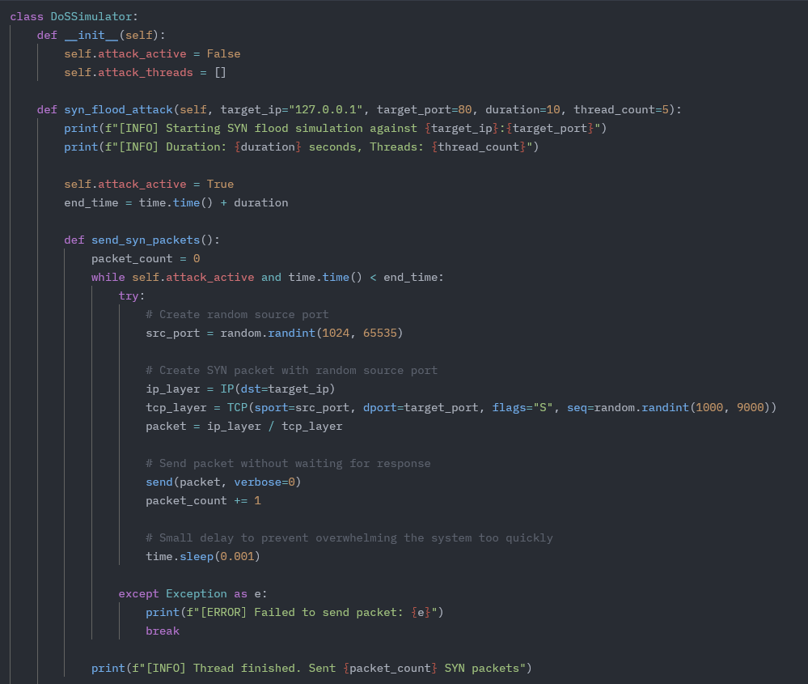
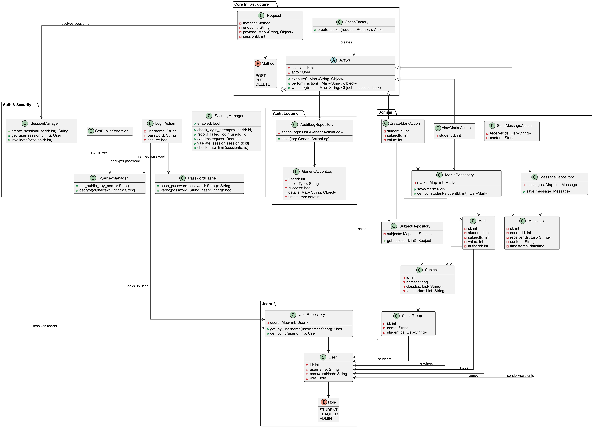
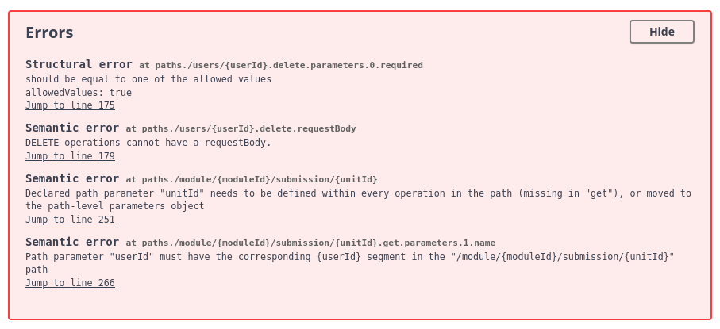

# Group Project

## Experience
This was my first experience of completing an assignment within a group environment. Having not completed a degree prior to enrolling on this course I was unsure what to expect. From speaking with friends and coworkers, their own experiences were varied. Some reported enjoyable experiences where they felt that they were put with a group of people who all bounced off of eachother and therefore produced a high pedigree of work. Whereas others reported teammates who struggled to pull their weight and contributed little to the project. Going into it I therefore was hopeful that I would be grouped with people that fell into the former category described by those I know.

My experience was that even getting the group together on one platform to communicate was difficult. Another individual in the group sent an email to everyone suggesting we use Discord, with a link to a server they helpfully set up. This was perfect and I felt optimistic about having someone who took the initiative to do this. However I then found that I was the only one to join for some considerable time, with the two of us having to reach out to the tutor in order to have emails sent to their personal emails instead of university ones. This seemed to make others take notice and we finally had a group together in the Discord.

By this point however, the two of us had drafted the team contract as we had already exceeded the deadline having waited for others to join. Overall though I was happy with the contract we drafted, I drew on my experience as a software engineer to define roles that each of us could take turns doing. I decided to use roles commonly used in an agile workflow, as these are what I am most familiar with, such as Product Owner and Scrum Master. I felt that using roles with well defined responsibilities would help those less familiar in knowing what their role would be that week (the intention was to rotate roles weekly.)

Once we had the entire team in the Discord I was then proactive about trying to organise a call where we could brainstorm together. I felt that this was important. It would have been possible to do this over instant messaging but due to being in different time zones I really felt the asynchronous nature would complicate things. I found that organising this call was incredibly difficult though. It seemed to be only myself and the other more proactive team member who made any attempt at getting the team together, we both utilised a combination of messaging and polls to make it as easy for others to respond as possible however neither had much success. We eventually did manage to agree a time and date but only after a number of messages stressing the urgency of the situation.

Our one team meeting was reasonably successful. The three of us who were present were all attentive to one anothers thoughts and suggestions. The end result was a directed approach we all agreed on with packages of work being distributed to each team member. I was assigned to look into how each of the security vulnerabilities would be implemented in the design. This lead to me attempting to perform a Denial of Service (DoS) attack on my own computer as a proof of concept. This form of attack involves making a computer system, service or network unavailable to intended users by flooding it with illegitimate requests. As a result users may experience slow performance while the large volume of requests are processed (Mirkovic et al., 2004). One method I attempted was using SYN floods, an excerpt of which can be seen below.

The intended result was to slow a simple server script running in parallel due to the demand to field so many requests. However this didn't ultimately work, I believe due to pre-configured firewall rules on my machine. I could have further investigated one of the methods introduced in Unit 2, Evil Regex, a type of regular expression that can cause large amounts of backtracking and therefore cause a programme to crash or freeze (https://owasp.org/www-community/attacks/Regular_expression_Denial_of_Service_-_ReDoS). My answers to the questions posed in this unit are below.
    
    1. What is Evil Regex?
       **Regular expressions that are vulnerable to catastrophic backtracking in which the regex engine hangs on certain expressions due to nested quantifiers or ambiguous patterns. It results in performance issues or even system crashes and is therefore considered a security risk.**
    2. What are the common problems associated with the use of regex? How can these be mitigated?
       **Catastrophic backtracking  - can be mitigated by avoiding nested quantifiers such as (.*)
         Overly complex expressions - tools such as regex101 can be used to test patterns earlier
         Security vulnerabilities   - execution timeouts when used in environments requiring better security**
    3. How and why could regex be used as part of a security solution?
       **Regular expressions can be a powerful tool in security solutions for:
         - Input validation: Ensuring user inputs match expected formats such as email addresses
         - Pattern detection: Identifying suspicious patterns in logs or file names, for example SQL injection attacks
         - Data sanitization: Stripping or replacing unsafe characters from user input**

I found that the quality of the work from my teammates varied. The class diagram I was impressed with and the individual repsonsible was eager to make updates in response to my comments and in accordance with any directional shifts in our design - even while attending a business conference for their full-time job. I found this dedication to ensuring the team achieved its goal commendable and made sure to feed this back to them, in addition to stressing that it shouldn't leave them feeling stressed or that too much is expected of them.

However the API specification that was first delivered I found to be slightly lacking. A link was provided to a website that could be used to visualise the API, however when I went to view it there were basic syntax errors preventing it from showing properly.

This meant they either didn't proof check it themselves on this website they were providing us, or simply didn't think to rectify the basic errors. I found this lack of attention a signal that they had not been thorough in their checking of their own work before sharing which I found disappointing as it signalled a lack of concern towards the quality of work we submit.

## Reflections
I would say my feelings towards my experience overall trend negatively unfortunately. I felt that two of us in the team were reponsible for the majority of the work. Although I took a leading role, I felt that I was forced to take action due to the inaction of others. The lack of opportunities for brainstorming within the team was what I felt held us back most.

The part that I struggle to understand most is why it was so hard to organise calls between the team. I was always of the opinion that getting something organised early and seeting a direction for our desig would give us the best chance of producing a quality submission. Having reflected on this intensly since, I'm no closer to an answer. Perhaps by taking a more leading role, others found it easier to relinquish responsibility and allow the process to unfold passively, trusting that I would keep things moving. Another possible explanation is that their working styles simply differed from mine. I did notice a surge in activity as the deadline approached, which suggests they were more comfortable leaving things until later, whereas I preferred to get started earlier.

Following the conclusion of this task, I explored resources to better understand team dynamics in online learning environments. In doing so, I wanted to see if the tutor had made any publications on the topic as I felt this would be directly applicable. I was pleasantly surprised to find a publication focused on students’ experiences with group work in virtual settings. I found that many of the experiences shared here matched my own. One point that stood out to me from the tutor’s publication was the observation that, in many teams, there was often a member who contributed less significantly than others. Interestingly, this wasn’t usually reported directly by the teams but was inferred through individual performance on related assessments. This resonated with me during our own group task, as it highlighted the challenge of addressing imbalances in participation. It made me more mindful of the importance of clear communication within the team and the role that group dynamics can play in shaping both outcomes and individual learning (https://doi.org/10.2478/eurodl-2023-0001)

### References
Mirkovic, J. et al. (2004) _Internet Denial of Service: Attack and Defense Mechanisms_, O'Reilly: Pearson. Available at: https://learning.oreilly.com/library/view/internet-denial-of/0131475738/ch02.html#ch02 (Accessed: 21 May 2025).

