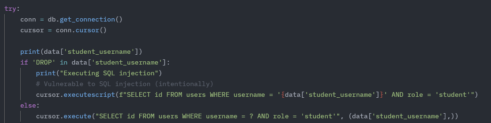
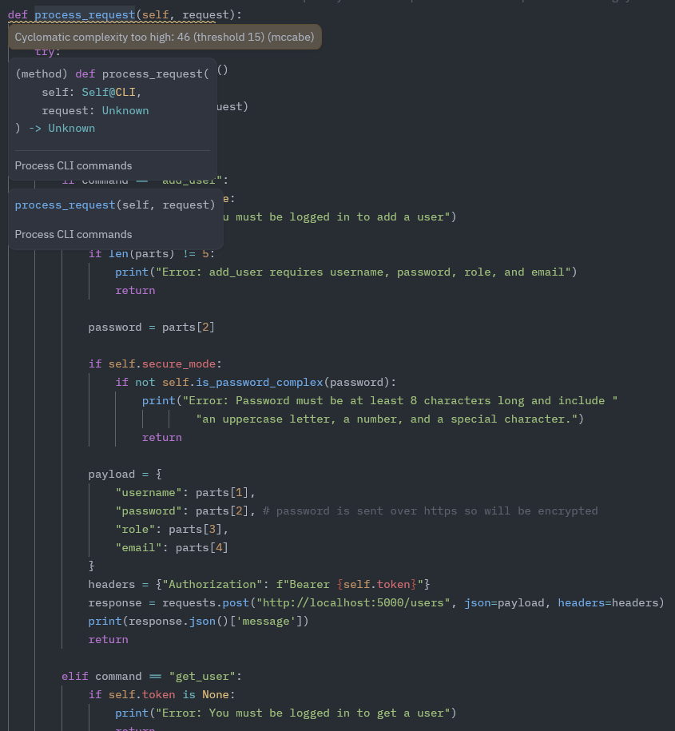
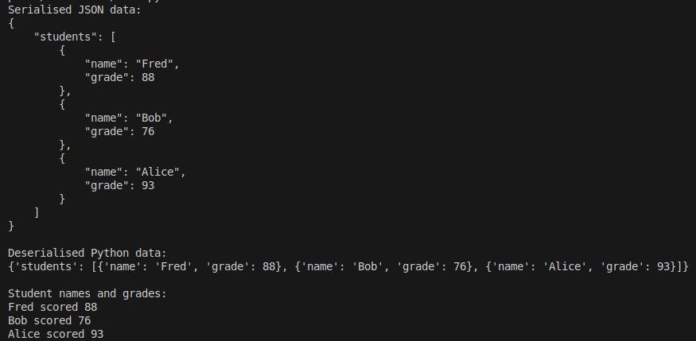

# Individual Coding Assignment

## Experience
I found that I learned the most from the individual coding assignment. I felt that the problem environment was interesting and applied many of the learned concepts in a way that made the problem of security feel more real. Below are some reflections looking back on how the solution evolved following the group project.

### System Design
The design proposed in the group assignment was a lot more complex than that of the final implementation. This was mostly however due to the fact that the Flask-RESTful library superseeded many of the classes defined in the class diagram. For example, the SessionManager functionality is something that is offered out of the box by way of providing the developer with a way to get the token of the user that is logged in. This made session authentication as simple as decoding the session token and checking the correct priviledges were held to perform the requested operation. Having security features managed by a well-known library is preferable since as an individual I am much more likely to make mistakes implementing these features. It does however mean that should a security vulnerability be found in this library, my application becomes at risk.

### Development Approach and Issues
I found that I spent too much time debugging issues relating to small logic errors that resulted in database or run-time exceptions. Looking back, this can be partly attributed to my approach regarding endpoints. I still believe that the approach to have one set of secure and insecure endpoints, with logic to route to the relevant one depending on whether or not the application was in secure mode, was a sensible one. However this did ultimately result in large amounts of duplicated code that meant I would fix many similar bugs in multiple areas. If I were to repeat the assignment I would spend time consolidating this duplicate code into helper functions that each endpoint could make use of. My original thinking was that I would get around to this once I had implemented the base set of features however it would have saved me more time in the long run I expect were I to address this sooner.

In order to make the system susceptible to SQL injection attacks, SQL parameterisation was not used, instead being replaced with the `executescript` function which can be used to chain multiple commands together.



My original intention was to have all insecure endpoints susceptible in this way however I discovered that using this function meant no results were returned when querying a database therefore preventing proper functionality. This was another sink of time, as I spent considerable effort trying for both functionality alongside susceptibility. Ultimately I decided that it was better to leave a single endpoint exposed and make a hard check for the contents of the request, in the interest of time.

### Testing
Due to the aforementioned lack of time towards the end of the assignment, testing was neglected more than I would have liked. I used PyTest to write some unit tests that verified permissions based functionality however I recognise the scope of this was limited. For example there were no tests verifying that records had been properly deleted following a request to do so. Should the testing approach been allotted more time, I believe it would have become more difficult to test due to some of the code. For example the `process_command` function which handles user input within the command line interface (CLI) programme, seen below.



As can be seen, the IDE is warning of high cyclomatic complexity which is a measure of the number of linearly independent paths that a piece of software can take (McCabe, 1976). It is just one way to apply metrics to software in order to measure its complexity. This was touched on in unit 5, with my thoughts on the question given presented below.

**_The Cyclomatic Complexity is commonly considered in modules on testing the validity of code design today. However, in your opinion, should it be? Does it remain relevant today?:_**  Being able to apply metrics to your code in order to generate an objective figure for properties such as complexity can no doubt be useful. However for me, the question remains of how much use this is to the developer. Personally I believe that it should still be considered but not in isolation. That is to say that it offers just one viewpoint as to the quality of a piece of code. It can be useful in identifying overly complex code that has many branches and therefore possible routes it can take. The result is that you end up with code that is harder to maintain and test, especially should unit tests be written that aim to cover each path. However, with today's modern practices making use of automated testing tools the effort to exhaust these paths is not quite as large as it once was.
From the perspective of applying cyclomatic complexity to my own professional role as a software engineer, there are times in which I appreciate code readability over what may be deemed higher quality code. In live systems I would agree that reducing the complexity through lowering cyclomatic complexity is desireable however for simple scripting or ancillary services this is likely to be less of a concern, with getting something together to achieve a goal limited in scope is likely to be more desireable.

I found that the formative activities in the weeks leading up to the individual assignment really helped in understanding the context of the task. I found the reading of chapter 9 in 'Python Object-Oriented Programming' in Unit 8 especially useful as it helped remind me of the concepts of serialisation and deserialisation. Knowing how to serialise the data to be passed between the two executables in my programme was important and so I wrote a small python script that made use of the "json" library to perform these operations on some example data.

```python
import json

grades_data = {
    "students": [
        {"name": "Fred", "grade": 88},
        {"name": "Bob", "grade": 76},
        {"name": "Alice", "grade": 93}
    ]
}

# Serialisation
grades_json = json.dumps(grades_data, indent=4)
print("Serialised JSON data:")
print(grades_json)

# Deserialisation
loaded_data = json.loads(grades_json)
print("\nDeserialised Python data:")
print(loaded_data)

# Print data
print("\nStudent names and grades:")
for student in loaded_data["students"]:
    print(f"{student['name']} scored {student['grade']}")
```

Running this helped visualise the format my data would take in the final application. The output can be seen below.



My final implementation made use of these and I felt that this small exercise was helpful in giving me a prior understanding of what was happening under the hood.

Additionally, the Unit 10 seminar was extremely useful in providing a place to get started with using Flask-RESTful. The linked webpage describing how the app works I found to be invaluable as it really helped clear up some of the confusion I had. Primarily this was in relation to endpoints, which I had interpreted as being something the developer had to explicitly setup themselves however after reading this it soon dawned on me that flask was doing a lot of the heavy lifting in the background. This undoubtedly saved me lots of time that could have taken away precious development time.

## Reflection
Overall I was dissapointed in what I achieved in this assignment and know that I could have produced something of much better quality. It's been a common theme, not only in university assignments but in professional work, that I can sometimes lose the forest for the trees. On reflection I became so bogged down in fixing small bugs rather than taking a step back and realising that putting some time toward refactoring the code would have solved many of these. In the future I aim to be more deliberate about how I spend my time. One method I have devised to do so is to allocate a certain amount of time to a problem, say an hour, with the intention that if it isn't solved I revisit it at a later time with a fresh mind. I often find that coming back to a problem, the solution presents itself immediately.

An aspect of the assignment I enjoyed was the continuity from the previous design assignment. I enjoy the separation in first considering how best to design the application to then implementing it. It can be all too easy to want to dive into the coding however having the design come first gave me the time and space to properly consider what the ideal solution might look like.

### References
McCabe, T. J. (1976) 'A Complexity Measure', **IEEE Transactions On Software Engineering**, SE-2(4), pp. 309. Available at: https://ieeexplore-ieee-org.uniessexlib.idm.oclc.org/stamp/stamp.jsp?tp=&arnumber=1702388&tag=1 (Accessed: 17 July 2025)