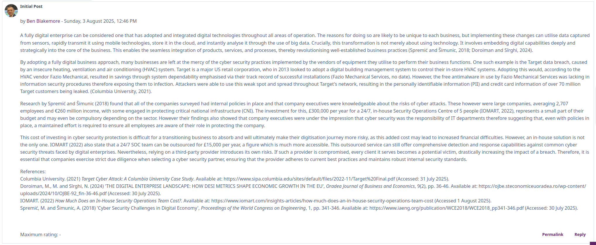
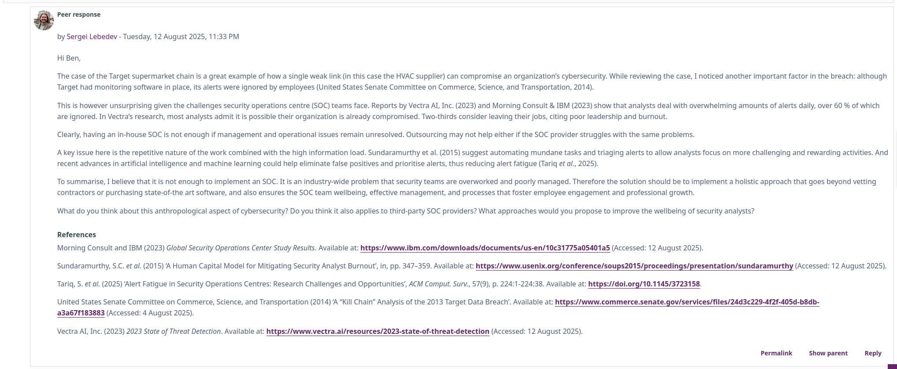
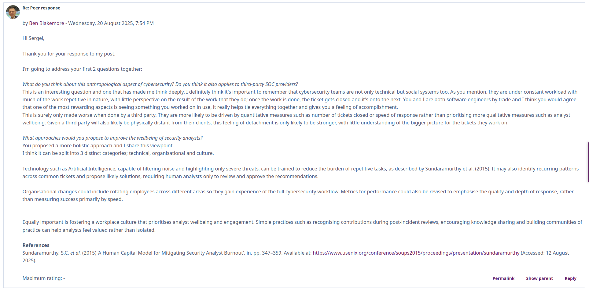
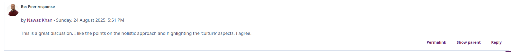
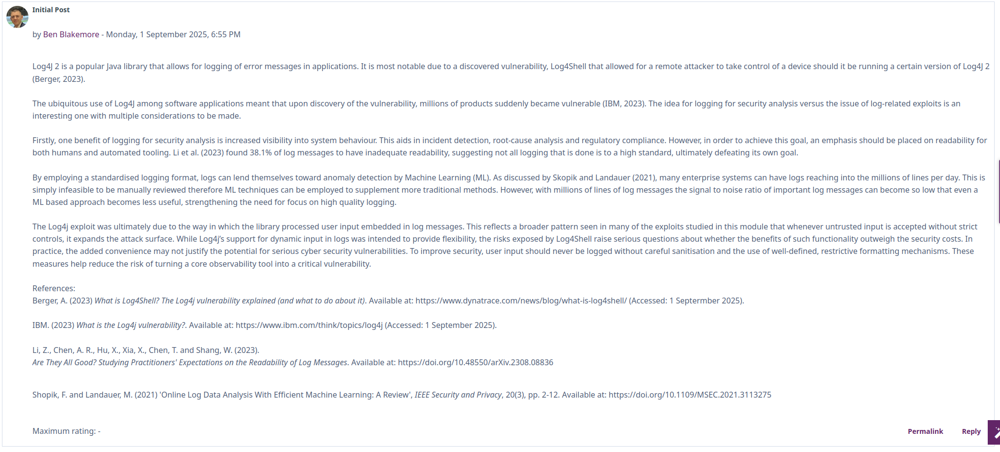

# Collaboration
The collaborative discussions offered a format for me and my fellow students to exchange thoughts with each other. In previous modules these have had mixed levels of participation, which I felt lead to them not achieving their full potential. Thankfully there was increased activity this time around, with multiple responses to many of the posts, including my own.

I found the discussion focussing on the challenges faced by traditionally brick-and-mortar businesses in transforming towards digital enterprises interesting. Shown below is my initial post on the topic.

As part of my post, I referred to the 2013 Target data breach, where attackers exploited a vulnerability in a third-party heating, ventilation, and air-conditioning (HVAC) system to gain access to Target’s network, ultimately compromising the Personally Identifiable Information (PII) of over 70 million customers (Columbia University, 2021). This case highlighted a recurring theme throughout the module: weaknesses in third-party applications or integrations can act as indirect entry points, exposing an organisation’s own systems and services to significant risk.

I received a response from Sergei, one of my fellow course mates, shown below.

I felt that this response really engaged with my initial post and gave me some great questions to address in my follow-up post, shown below.

I particularly liked the question he raised about improving the wellbeing of security analysts. My main takeaway from the discussion with Sergei was the importance of remembering that there are real people at the heart of a Security Operations Centre (SOC). To maintain both effectiveness and positive outcomes, their roles need to remain varied, engaging, and rewarding, rather than becoming repetitive or overwhelming.

It was nice to see the tutor then reply to the discussion, giving a positive response on the discussion that he had seen.

This was a nice way to finish the discussion and validated for me that the topics discussed within were both relevant and something in which a subject matter expert agreed upon.

--------------------------------------------------------------------------------------------------------------------------------------------------------

The second discussion topic was one I was familiar with - the Log4J exploit. When this occurred, in 2021, I remember reading many articles and news stories on it, trying to understand how it had come about so it was nice to revisit it - and already having a basic understanding of the context certainly helped!

Below is my initial post into the second collaborative discussion forum.

# References
Columbia University. (2021) _Target Cyber Attack: A Columbia University Case Study_. Available at: https://www.sipa.columbia.edu/sites/default/files/2022-11/Target%20Final.pdf (Accessed: 31 July 2025).