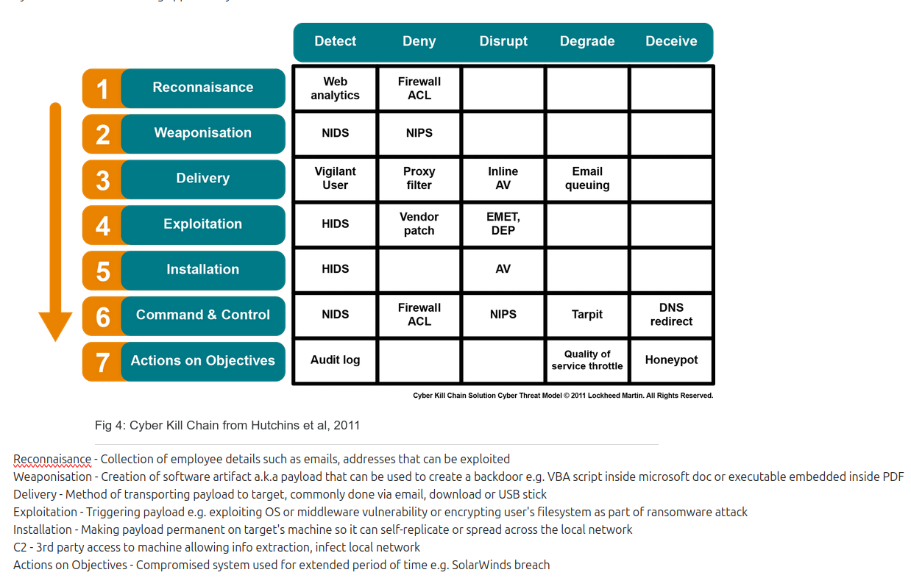
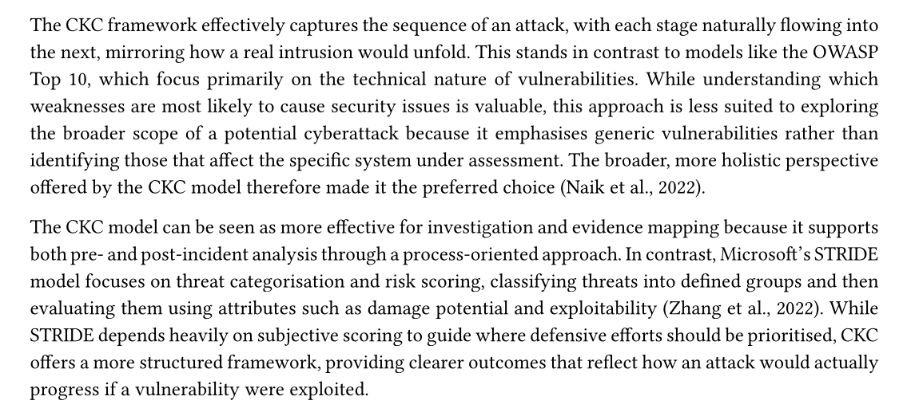
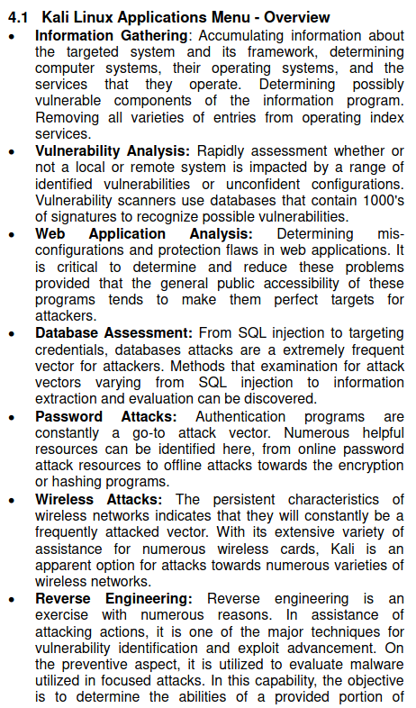
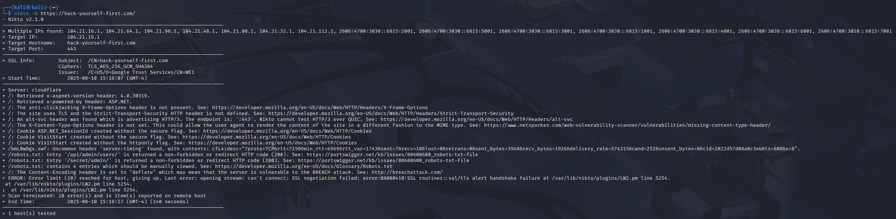
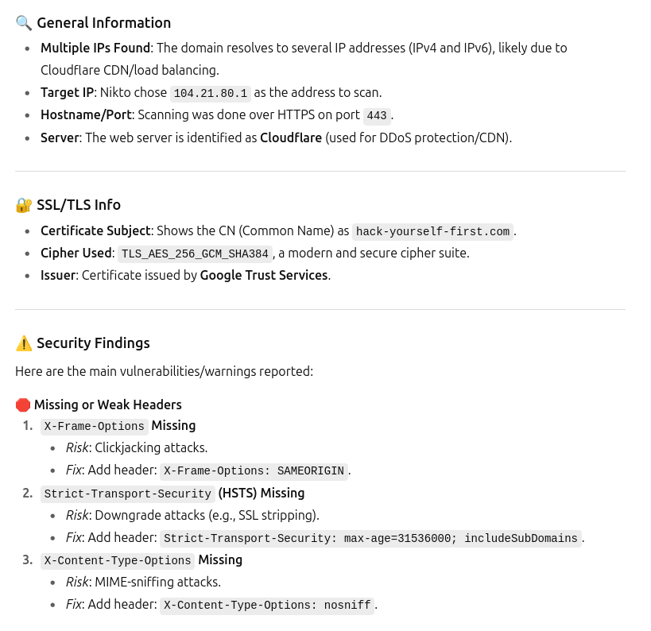

# Skillset

Coming into this module, my exposure and knowledge in regards to network security were minimal. In my job as a software engineer I very rarely have to consider the security side of the software that I am writing, so I was excited to learn more about this.

The reading material in each week has really helped me build a solid foundation on which to take on the summative assignments. One of the first concepts I was introduced to was the Cyber Kill Chain (CKC), through the first lecturecast. This is just one of the many methodologies that potential attackers may follow in order to exploit security vulnerabilities. My initial notes on the CKC methodology are shown below.

I particularly liked the CKC framework, the reasons for which are described below in this excerpt from my baseline review and analysis assignment.

In summary, what gravitated me towards the CKC methodology was its use of chronology to effectively help timeline an attack, which I felt made it easier to anticipate how certain vulnerabilities might be exploited.

In order to utilise these methodologies, an attacker must have knowledge of some of the tools that can be used in order to elicit helpful information on their target, such as exposed endpoints or user details that are not correctly encrypted. Through my professional work I have come to know that such tools exist, however until beginning this module I had no knowledge of how they worked or how one could use them but was excited to learn.

While browsing the module reading list, one of the entries for Unit 4 caught my eye - "Modern Day Penetration Testing Distribution Open Source Platform - Kali Linux". Being already familiar with Linux this piqued my interest as Kali Linux was something I was vaguely aware of however had never been exposed to. I read the paper and found myself fascinated with some of the capabilities supported out-of-the-box. Section 4.1 listed some of the main functionality supported by Kali Linux, shown below.

I was excited to try some of this out on the website I had chosen for the vulnerability assignment, hack-yourself-first.com, so spun up an instance on VirtualBox. As always, I was impressed at how quick and seamless this process was. Within minutes I had a fully functional Virtual Machine of Kali Linux up and running.

I quickly began googling some of the standard utils that were now available to me in order to begin investigating my chosen website.

One such tool was Nikto, a web server vulnerability scanner - just what I was looking for! I looked up the man page and ran a scan against my chosen website.

I hardly understood any of the output it had given me so simply pasted the output into ChatGPT; I often find that for subjects in which I know nothing, doing this provides me with a great foundation to go and research further. 

I used this response to conduct a deeper review into what the tool was telling about my website. Across the entirety of the module I found Nikto to be of most use, it's informative yet clean output made it very simple to see the list of vulnerabilities the site suffers from.

--------------------------------------------------------------------------------------------------------------------------------------------------------

# References