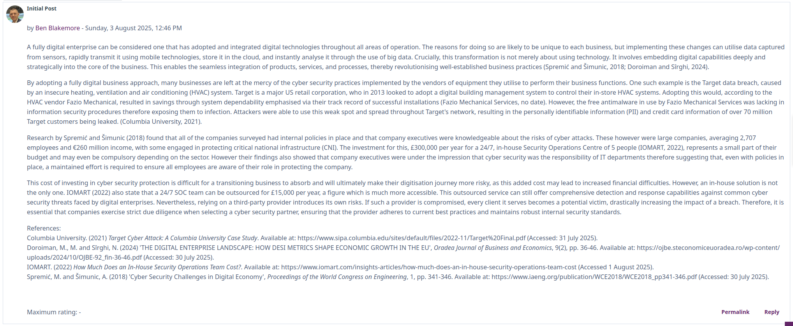

# Collaboration
The collaborative discussions offered a format for me and my fellow students to exchange thoughts with each other. In previous modules these have had mixed levels of participation, which I felt lead to them not achieving their full potential. Thankfully there was increased activity this time around, with multiple responses to many of the posts, including my own.

I found the discussion focussing on the challenges faced by traditionally brick-and-mortar businesses in transforming towards digital enterprises interesting. Shown below is my initial post on the topic.

TODO add content from second discussion

# References
